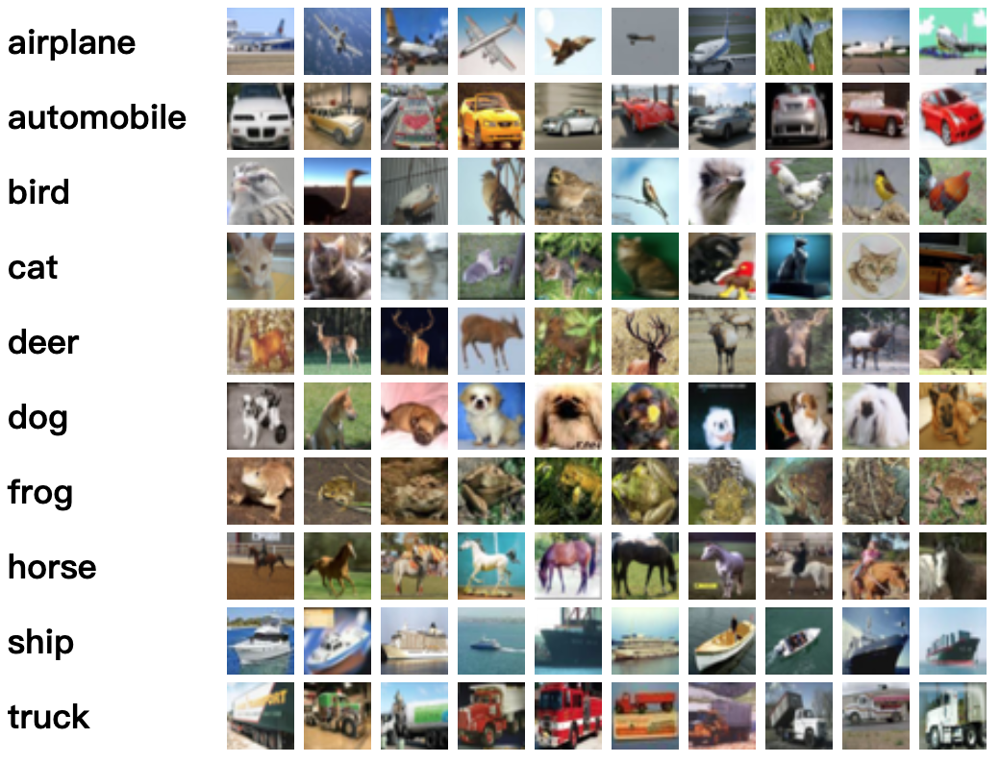
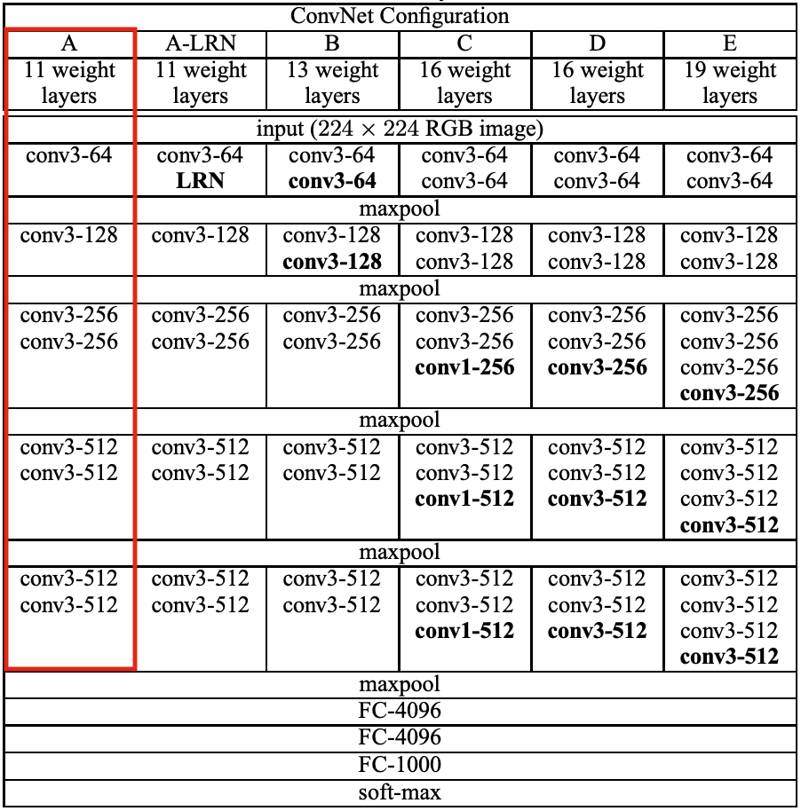
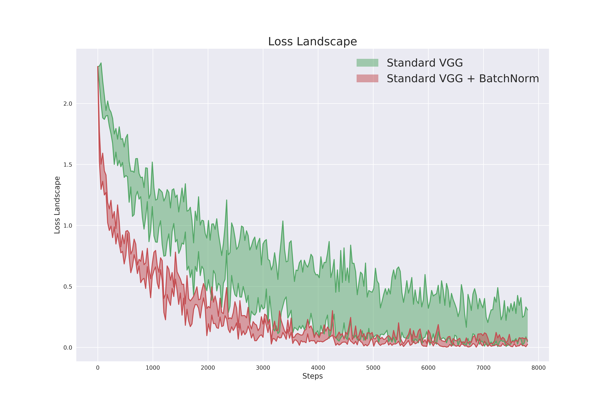

# 《神经网络与深度学习》Project 2

作者：Yanwei Fu  
日期：2026 年 5 月 8 日

## 摘要

（1）这是本课程的第二个项目。截止时间为 **2026 年 6 月 14 日 23:59**。请通过 elearning 上传报告。

（2）报告的目标是记录你完成的实验以及主要发现。因此，请务必解释实验结果。提交的报告应为一个 PDF 文件。请在提交文件中附上代码的 GitHub 链接。你还需要在报告中提供数据集和训练好的模型权重的链接。你可以将数据集和模型上传到 Google Drive 或其他网盘服务平台。同时，请在论文中写明姓名和学号。缺少代码链接或模型权重链接将导致扣分。

（3）关于截止时间与扣分。一般来说，你应当按照每个项目的截止时间提交论文。逾期提交也可以接受；但是，每延迟一周将扣除 10% 的分数。

（4）对于低年级学生，建议从 CIFAR-10 示例的 MindSpore 教程开始：

https://mindspore.cn/docs/api/zh-CN/r1.5/api_python/dataset/mindspore.dataset.Cifar10Dataset.html

## 1. 在 CIFAR-10 上训练网络（60%）

CIFAR-10 [4] 是一个广泛用于视觉识别任务的数据集。CIFAR-10 数据集（Canadian Institute For Advanced Research）是一组图像集合，常用于训练机器学习和计算机视觉算法。它是机器学习研究中使用最广泛的数据集之一。CIFAR-10 数据集包含 60,000 张 $32\times32$ 的彩色图像，共分为 10 个不同类别。这 10 个类别分别是飞机、汽车、鸟、猫、鹿、狗、青蛙、马、船和卡车（如图 1 所示）。每个类别有 6,000 张图像。由于 CIFAR-10 中的图像分辨率较低（$32\times32$），该数据集可以让我们快速尝试模型并检查其是否有效。

在本项目中，你将在 CIFAR-10 上训练神经网络模型以优化性能。请报告你在该数据集上能够达到的最佳测试错误率，并说明你为达到该结果所构建的网络结构。



### 1.1 入门

1. 你可以从官方网站 [2] 下载数据集，也可以使用 torchvision 包。下面是 PyTorch [1] 提供的示例。

```python
import torch
import torchvision
import torchvision.transforms as transforms

transform = transforms.Compose([
    transforms.ToTensor(),
    transforms.Normalize((0.5, 0.5, 0.5), (0.5, 0.5, 0.5))
])
trainset = torchvision.datasets.CIFAR10(
    root='./data',
    train=True,
    download=True,
    transform=transform
)
trainloader = torch.utils.data.DataLoader(
    trainset,
    batch_size=4,
    shuffle=True,
    num_workers=2
)
testset = torchvision.datasets.CIFAR10(
    root='./data',
    train=False,
    download=True,
    transform=transform
)
testloader = torch.utils.data.DataLoader(
    testset,
    batch_size=4,
    shuffle=False,
    num_workers=2
)
```

当创建数据集时设置 `download=True`，程序会自动将数据集下载到定义的 `root` 路径。关于神经网络模型的构建、训练与测试，可以先阅读教程 [1]。

2. 你的网络需要包含以下所有组件：（16%）

   a. 全连接层；  
   b. 二维卷积层；  
   c. 二维池化层；  
   d. 激活函数。

3. 你的网络可以包含以下部分组件（至少一个）：（8%）

   a. Batch-Norm 层；  
   b. Dropout；  
   c. 残差连接；  
   d. 其他组件。

4. 为了优化网络，你需要尝试以下所有策略：（8%）

   a. 尝试不同数量的神经元/滤波器；  
   b. 尝试不同的损失函数（带有不同正则化）；  
   c. 尝试不同的激活函数。

5. 为了优化网络，你可以选择以下一种策略：（8%）

   a. 使用 `torch.optim` 尝试不同的优化器；  
   b. 自己为包含 2(a)-2(d) 的网络实现一个优化器（你不能使用 `torch.nn`、`torch.sigmoid` 等；可以使用 `torch.matmul` 等），并使用 `torch.optim` 优化完整模型；  
   c. 自己为完整模型实现一个优化器。

6. 展示你对网络的洞察，例如滤波器可视化、损失景观、网络解释等。（8%）

### 1.2 本任务评分标准

是的，你完全可以自由使用 torch、PyTorch 或其他深度学习工具箱中的任何组件。那么，我们如何为本任务评分？我们关注：

（1）（12%）网络的分类性能，并结合网络总参数量、网络结构和训练速度进行评价。对于结果相近的项目，我们会检查总参数量、网络结构，或者是否使用了新的优化算法来训练网络。

（2）对已学习模型、训练过程或类似内容的任何有洞察力的结果和有趣可视化。

（3）你可以报告多个网络的结果；但如果你直接使用公开可用模型而不做任何修改，你的项目分数会被略微扣除。

## 2. 批归一化（30%）

批归一化（Batch Normalization, BN）是一种被广泛采用的技术，它能够使深度神经网络（DNN）训练得更快、更稳定。由于 BN 通常能够提升精度并加速训练，它已经成为深度学习中常用且受欢迎的技术。从高层次来看，BN 旨在通过稳定各层输入的分布来改进神经网络训练。这是通过引入额外的网络层来控制这些分布的前两个矩（均值和方差）实现的。

在本项目中，你将首先测试 BN 在训练过程中的有效性，然后探索 BN 如何帮助优化。示例代码由 Python 提供。

### 2.1 批归一化算法

这里我们主要考虑卷积神经网络中的 BN。BN 层的输入和输出都是四维张量，分别记为 $I_{b,c,x,y}$ 和 $O_{b,c,x,y}$。这些维度分别对应批内样本 $b$、通道 $c$ 以及两个空间维度 $x,y$。对于输入图像，通道对应 RGB 通道。BN 对给定通道中的所有激活使用相同的归一化方式：

$$
O_{b,c,x,y}\leftarrow \gamma_c
\frac{I_{b,c,x,y}-\mu_c}{\sqrt{\sigma_c^2+\epsilon}}
+\beta_c
\qquad \forall b,c,x,y.
$$

这里，BN 会从通道 $c$ 的所有输入激活中减去平均激活

$$
\mu_c=\frac{1}{|\mathcal{B}|}\sum_{b,x,y}I_{b,c,x,y},
$$

其中 $\mathcal{B}$ 包含整个 mini-batch 中通道 $c$ 的所有激活，覆盖所有特征 $b$ 以及所有空间位置 $x,y$。随后，BN 会将中心化后的激活除以标准差 $\sigma_c$（再加上用于数值稳定性的 $\epsilon$），该标准差以类似方式计算。在测试阶段，使用均值和方差的滑动平均值。归一化之后，会进行一个按通道的仿射变换，该变换由 $\gamma_c,\beta_c$ 参数化，并在训练过程中学习得到。

**数据集。** 为研究批归一化，我们将使用如下实验设置：在 CIFAR-10 上进行图像分类，网络结构与 VGG-A 相同，但由于输入假定为 $32\times32\times3$，而不是 $224\times224\times3$，因此线性层的规模更小。所有示例代码均基于 PyTorch 实现。

你可以运行 `loaders.py` 下载 CIFAR-10 数据集，并输出一些样例以熟悉数据存储格式。注意，如果你使用远程服务器，需要使用 `matplotlib.pyplot.savefig()` 函数保存绘图结果，然后下载到本地查看。

### 2.2 带 BN 与不带 BN 的 VGG-A（15%）

在本节中，你将比较带 BN 和不带 BN 的 VGG-A 的性能与特征。我们鼓励你扩展并修改所提供的代码，以得到更清晰、更有说服力的实验结果。注意，你应当先理解代码，而不是把它当作黑箱使用。



如果你想使用部分数据集进行训练以更快得到结果，可以设置 `n_items` 来满足你的需求。基础的 VGG-A 网络已在 `VGG.py` 中实现，你可以先训练这个网络，以理解整体网络结构并查看训练结果。然后编写一个 `VGG_BatchNorm` 类，在原始网络中加入 BN 层，最后将两者的训练结果可视化并进行比较。用于训练和可视化的示例代码已包含在 `VGG_Loss_Landscape.py` 中。

### 2.3 BN 如何帮助优化？（15%）

仅仅使用 BN 是不够的。我们应当理解为什么它能在优化过程中发挥积极作用，从而更全面地理解深度学习的优化过程，并在未来工作中根据实际情况选择合适的网络结构。你可能需要查阅一些论文，例如 [3]。

那么，BN 背后的机制是什么？毕竟，为了理解 BN 如何影响训练性能，考察 BN 对相应优化景观的影响是很自然的。为此，请回忆我们的训练是通过梯度下降方法完成的，而该方法基于一阶优化范式。在这一范式中，我们使用当前解附近损失函数的局部线性近似，来确定应当采取的最佳更新步。因此，这类算法的性能在很大程度上取决于该局部近似对附近损失景观的预测能力。

近期研究结果表明，**BN 会重新参数化底层优化问题，使其景观显著更加平滑**。因此，沿着这一思路，我们将测量：

1. 损失景观，或损失值的变化；
2. 梯度预测性，或损失梯度的变化；
3. 距离上的最大梯度差异。

#### 2.3.1 损失景观

为了测试 BN 对损失本身稳定性的影响，即其 Lipschitz 性，在训练过程的每个给定步骤中，你应当计算该步骤处损失的梯度，并测量当我们沿该方向移动时损失如何变化。也就是说，在某个特定训练步骤处，测量损失的变化。一个简单实现可以按照以下方式进行：

1. 选择一组学习率来表示不同步长，并据此训练和保存模型（例如 `[1e-3, 2e-3, 1e-4, 5e-4]`）；
2. 保存所有模型在每一步的训练损失；
3. 维护两个列表：`max_curve` 和 `min_curve`。在同一步上，从所有模型的损失中选出最大值并加入 `max_curve`，选出最小值并加入 `min_curve`；
4. 绘制这两个列表的结果，并使用 `matplotlib.pyplot.fill_between` 方法填充两条曲线之间的区域。

对带 BN 的 VGG-A 模型使用相同方法。最后，尝试将带 BN 与不带 BN 的 VGG-A 结果可视化到同一张图中，以得到更直观的结果。



为了帮助你更好地理解，我们提供了用于可视化损失景观的示例代码（`VGG_Loss_Landscape.py`）。你需要理解代码，并训练不同模型来复现图 2 的结果。请自由修改和改进示例代码，并报告你选择的学习率。最重要的是，借助 `matplotlib.pyplot` 展示你的最终对比结果。

## 参考文献

[1] https://pytorch.org/tutorials/beginner/blitz/cifar10_tutorial.html  
[2] https://www.cs.toronto.edu/~kriz/cifar.html  
[3] Shibani Santurkar, Dimitris Tsipras, Andrew Ilyas, Aleksander Madry. *How Does Batch Normalization Help Optimization?* NeurIPS, 2018.  
[4] Alex Krizhevsky, Geoffrey Hinton, et al. *Learning multiple layers of features from tiny images.* 2009.
